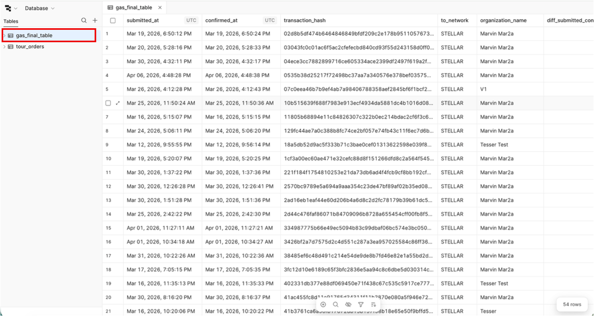
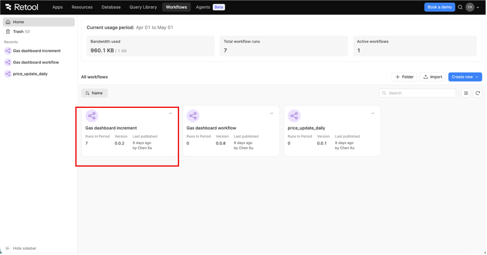
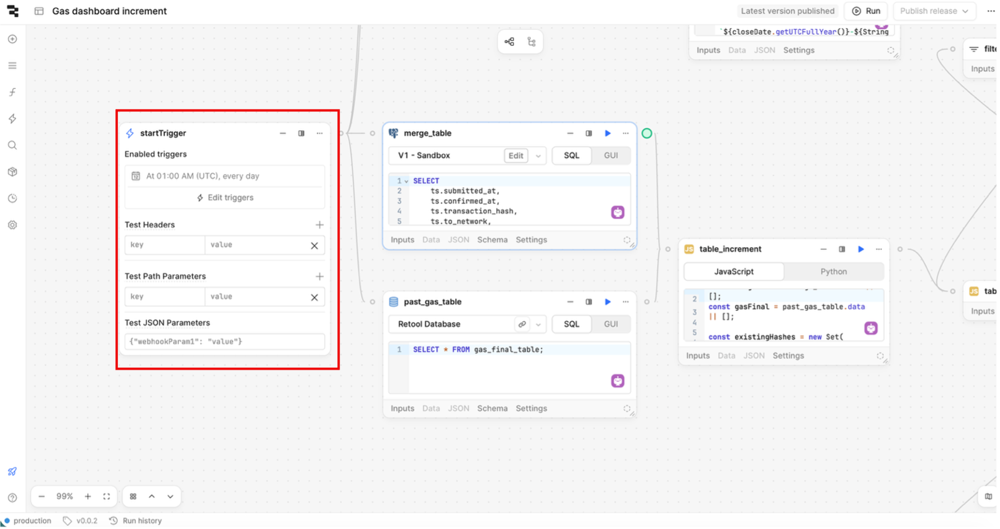
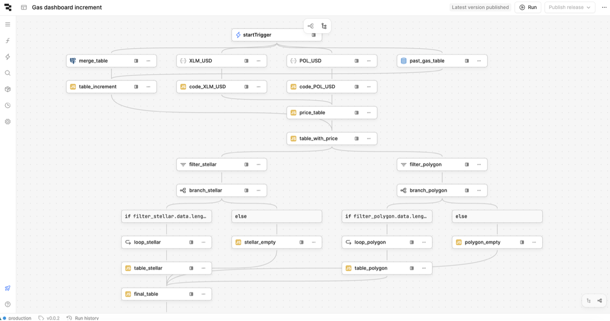
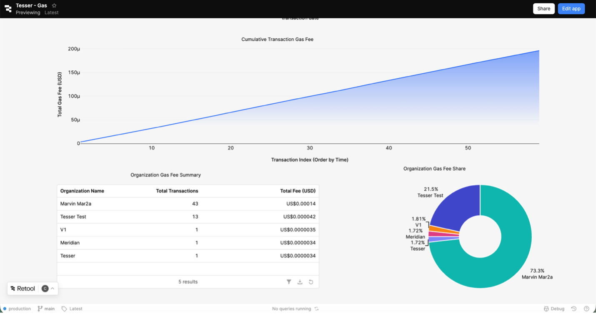
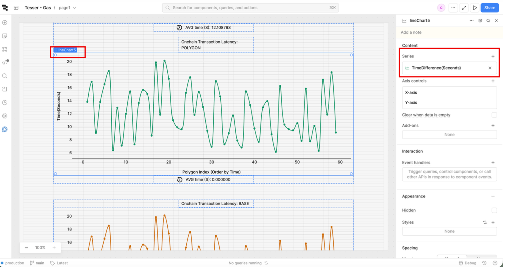
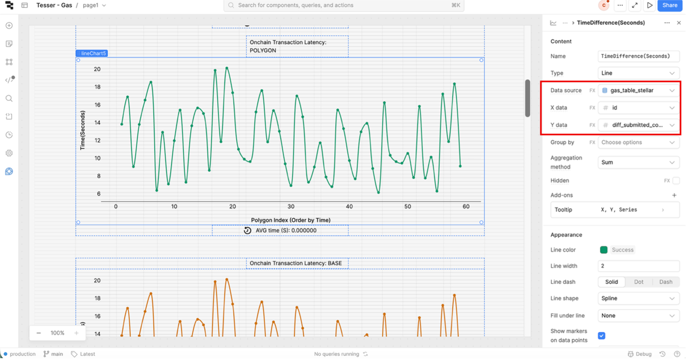

# **Tesser Gas Retool Dashboard Instruction**

**1.** **Database**

gas_final_table:

This table stores the processed data for the dashboard.

**2.** **Workflows**

Gas dashboard increment:

Synchronizes transaction records and daily crypto prices into the gas_final_table for
dashboard updates.

Trigger:

Scheduled via startTrigger to execute daily at 1:00 AM. This timing ensures that the
previous day's closing cryptocurrency prices are finalized and available for retrieval.

**Guide: Scaling to Additional Networks**

Components:

1. merge_table: Retrieves and aggregates raw data (e.g., transaction_hash,
confirmed_at, organization_id) from the V1-Sandbox database.

2. XLM_USD / POL_USD: Fetches historical daily prices from the CoinGecko REST API.
The requests are configured with specific parameters, including API keys, target
currencies, and a defined date range.

3. past_gas_table: Pulls existing records from gas_final_table to serve as the baseline
for the incremental update process.

Follow these steps to integrate a new network into the dashboard. Use the existing
implementations (Polygon/Stellar) as structural references. Replace {NETWORK} with the
identifier of the network you are adding (e.g., BASE):

1. Price Data Integration:

    - {NETWORK}_USD: Configure a new REST API resource to fetch daily prices.

    - code_{NETWORK}_USD: Implement a Transformer to parse the raw price data.
2. Transaction Filtering:

    - filter_{network}: Add a filter block to isolate transactions where to_network
matches the target.
3. Edge Case Handling:

    - branch_{network} & {network}_empty: Implement conditional logic to prevent
workflow breaks if no data is found.
4. On-Chain Data Retrieval:

    - loop_{network}: Configure a Loop block to query RPC nodes for granular gas
fees.
5. Data Structuring & Merging:

    - table_{network}: Structure the raw RPC responses.

    - final_table: Extend the merge logic to include the new {NETWORK} dataset.
6. Final Execution

    - Run Workflow: To ingest the data for the first time, click the Run button.

    - Deploy: Click Public Release to make the new network integration live on the
production dashboard.

**Note:** Integration for the Polygon and Base pathways is currently pending verification due to
limited test data. Please configure the APIs within loop_polygon and loop_base, and
update the logic in table_polygon and table_base to facilitate testing. Expect a period of
debugging and refinement during the initial staging or production rollout.

**3.** **Retool dashboard**

This dashboard provides a comprehensive visualization of gas fee dynamics, enabling
precise monitoring and analysis of transaction costs across integrated networks.

Pending Setup for Polygon & Base Networks:

All components are fully configured, with the exception of on-chain transaction latency and
gas fee metrics for the Polygon and Base networks (pending initial transaction data). To
finalize the setup:
1. Data Source: Select gas_table_polygon or gas_table_base.
2. X-Axis: Set to id.
3. Y-Axis: Select diff_submitted_confirmed_sec for latency or fee_usd for transaction
fees.